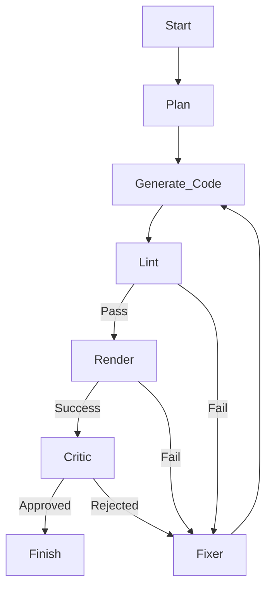

# Smart Learning: Markdown to Video (Auto Manim Generator)

An intelligent, autonomous system that transforms educational text scripts into professional-grade animated videos using [Manim](https://www.manim.community/) and Large Language Models (LLMs).

Powered by **LangGraph**, this project features a self-correcting "Agentic" workflow that mimics a real-world animation studio pipeline—comprising a Director (Planner), Animator (Coder), Reviewer (Critic), and Technical Lead (Fixer).

## 🚀 Key Features

*   **Script Rewriter**: Automatically converts raw text drafts into structured, scene-by-scene video storyboards.
*   **Multi-Agent Workflow**:
    *   **🧠 Planner**: Analyzes the scene requirements and designs a spatial layout strategy before any code is written.
    *   **👨‍💻 Coder**: Translates the plan into executable Manim (Python) code.
    *   **👀 Vision Critic**: Uses Multimodal LLMs (e.g., Qwen-VL) to inspect rendered frames for visual bugs (overlaps, cut-offs, legibility) and rejects low-quality output.
    *   **🔧 Fixer**: A specialized agent that analyzes runtime errors or visual feedback to generate precise repair instructions.
*   **Dockerized Rendering**: safely executes generated code in an isolated environment to prevent system side-effects.
*   **Auto-Healing**: The pipeline automatically retries and iterates on failed scenes, learning from error logs and visual feedback.
*   **Full Production**:
    *   **TTS Integration**: Generates voiceovers for each scene.
    *   **Assembler**: Stitches generated video segments and audio into a final polished `full_movie.mp4`.

## 🛠️ Installation

### Prerequisites
*   Python 3.10+
*   [Poetry](https://python-poetry.org/)
*   Docker (for safe rendering)
*   FFmpeg (for video assembly)

### Setup

```bash
# 1. Clone the repository
git clone https://github.com/your-repo/markdown-to-video.git
cd markdown-to-video

# 2. Install dependencies
poetry install

# 3. Configure Environment
# Copy the example env file and add your API keys (e.g., DashScope/OpenAI)
cp .env.example .env
```

## 📖 Usage

### 1. Basic Usage
Run the main script with your storyboard file:

```bash
poetry run python src/main.py input/my_script.json
```

### 2. Using the Rewriter (Text-to-Video)
If you only have a rough text draft, use the rewriter to generate the JSON first:

```python
# (Example usage via code - CLI coming soon)
from src.components.rewriter import ScriptRewriter
rewriter = ScriptRewriter()
script = rewriter.rewrite("Explain the concept of Binary Search using blue boxes.")
```

### Input JSON Format
```json
{
  "scenes": [
    {
      "scene_id": "01_intro",
      "description": "A title 'Binary Search' appears at the top. A sorted array of numbers 1-10 appears in the center.",
      "duration": 5.0,
      "elements": ["Title", "Sorted Array"],
      "audio_script": "Binary search is an efficient algorithm for finding an item from a sorted list of items."
    }
  ]
}
```

## 🏗️ Architecture

The system uses a **StateGraph** to manage the lifecycle of a scene:



## 📂 Project Structure

*   `src/main.py`: Entry point.
*   `src/core/graph.py`: The LangGraph definition (Nodes & Edges).
*   `src/components/`:
    *   `planner.py`: Layout strategy.
    *   `critic.py`: Visual Quality Assurance.
    *   `renderer.py`: Docker interaction.
    *   `assembler.py`: FFmpeg orchestration.
*   `output/`: Generated artifacts (videos, plans, debug logs).

## 🌍 Languages

*   [English](README.md)
*   [中文 (Chinese)](assets/README_cn.md)