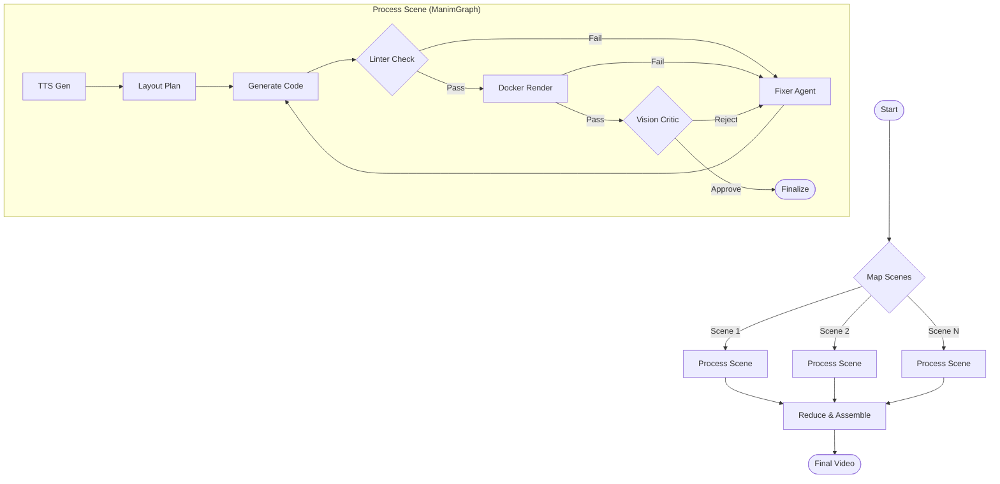

# Smart Learning: Markdown to Video (Auto Manim Generator) v3.0

An intelligent, autonomous system that transforms educational text scripts into professional-grade animated videos using [Manim](https://www.manim.community/) and Large Language Models (LLMs).

Powered by **LangGraph**, this project features a **Parallel** self-correcting "Agentic" workflow that mimics a real-world animation studio pipeline—comprising a Director (Planner), Animator (Coder), Reviewer (Critic), and Technical Lead (Fixer).

## 🚀 Key Features

*   **⚡ Parallel Processing**: Automatically distributes scene generation tasks across parallel workers for maximum efficiency.
*   **🤖 Multi-Agent Workflow**:
    *   **Planner**: Analyzes scene requirements and designs a spatial layout strategy.
    *   **Coder**: Translates the plan into executable Manim (Python) code.
    *   **Vision Critic**: Uses Multimodal LLMs (e.g., Qwen-VL) to inspect rendered frames for visual bugs (overlaps, cut-offs) and rejects low-quality output.
    *   **Fixer**: Analyzes runtime errors or visual feedback to generate precise repair instructions.
*   **🛡️ Dockerized Rendering**: Safely executes generated code in an isolated environment to prevent system side-effects.
*   **🔄 Auto-Healing**: The pipeline automatically retries and iterates on failed scenes, correcting both syntax errors (Linter) and visual defects (Critic).
*   **🗣️ Full Production**: Includes automated Text-to-Speech (TTS) generation and final video assembly with FFmpeg.
*   **📝 Flexible Input**: Accepts structured JSON storyboards or raw text/markdown drafts (automatically converted via an LLM Rewriter).

## 🏗️ Architecture

The system uses a **Parallel Map-Reduce StateGraph** to manage the lifecycle of the video generation:



## 🛠️ Installation & Setup

### Prerequisites
*   **Python 3.10+**
*   **[Poetry](https://python-poetry.org/)** (Dependency Manager)
*   **Docker** (Required for safe code execution)
*   **FFmpeg** (Required for assembling the final video)

### Step-by-Step Guide

1.  **Clone the repository**
    ```bash
    git clone https://github.com/your-repo/markdown-to-video.git
    cd markdown-to-video
    ```

2.  **Install Python Dependencies**
    ```bash
    poetry install
    ```

3.  **Build the Manim Docker Image**
    The system requires a local Docker image named `auto-manim-runner:v1`.
    ```bash
    docker build -t auto-manim-runner:v1 .
    ```

4.  **Configure Environment**
    Create a `.env` file in the root directory.
    
    **Required Configuration:**
    Only `DASHSCOPE_API_KEY` is strictly required. Other settings have sensible defaults.
    
    ```env
    # .env
    DASHSCOPE_API_KEY=sk-xxxxxxxxxxxxxxxxxxxxxxxx  # Your Aliyun DashScope API Key
    
    # Optional Overrides (defaults shown)
    # DASHSCOPE_BASE_URL=https://dashscope.aliyuncs.com/compatible-mode/v1
    # CODER_MODEL=qwen3-max
    # CRITIC_MODEL=qwen-vl-max
    # DOCKER_IMAGE=auto-manim-runner:v1
    ```

## 📖 Usage

### Basic Command
Run the main script with your input file (JSON, Markdown, or Text).

```bash
poetry run python src/main.py input/my_script.json
```

### Input Formats

**1. JSON Storyboard (Recommended)**
Precise control over scenes.
```json
{
  "scenes": [
    {
      "scene_id": "01_intro",
      "description": "A title 'Binary Search' appears at the top. A sorted array of numbers 1-10 appears in the center.",
      "duration": 5.0,
      "elements": ["Title", "Sorted Array"],
      "audio_script": "Binary search is an efficient algorithm for finding an item from a sorted list of items."
    }
  ]
}
```

**2. Raw Text / Markdown**
The system will automatically convert this into a storyboard using the **Rewriter Agent**.
```text
Explain the concept of Photosynthesis. 
Start with the sun shining on a plant.
Then show water entering the roots and CO2 entering the leaves.
```

## 📂 Project Structure

```
markdown-to-video/
├── assets/                 # Documentation assets
├── development_assets/     # Design docs
├── lib/                    # Static resources (API stubs, examples)
├── output/                 # Generated artifacts (Videos, Audio, Code)
├── src/
│   ├── components/         # Core Agents (Planner, Critic, Renderer...)
│   ├── core/               # System Logic (Graph, Config, State)
│   ├── llm/                # LLM Client & Prompts
│   ├── utils/              # Helpers
│   └── main.py             # Entry Point
├── tests/                  # Unit & Integration Tests
├── Dockerfile              # Manim Environment
└── pyproject.toml          # Dependencies
```