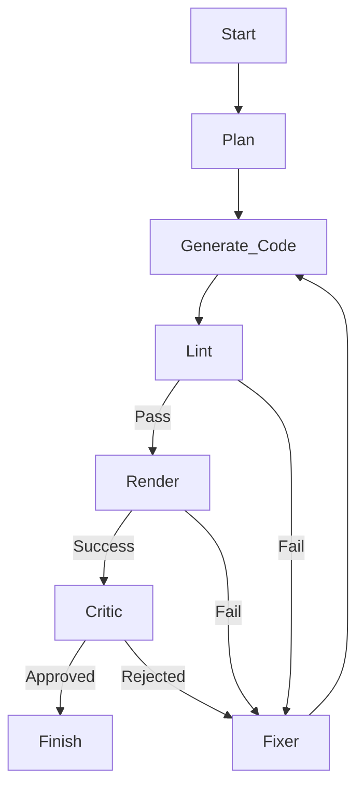

# Smart Learning: Markdown to Video (智能 Manim 视频生成器)

这是一个智能化的自动化系统，能够利用 [Manim](https://www.manim.community/) 和大语言模型 (LLMs) 将教育文本脚本转化为专业级的动画视频。

本项目由 **LangGraph** 驱动，采用具备自我修正能力的“Agentic”工作流，模拟了真实的动画工作室流水线——包含导演 (规划器)、动画师 (编码器)、审核员 (批评家) 和技术主管 (修复器)。

## 🚀 核心功能

*   **脚本重写器 (Script Rewriter)**：自动将原始文本草稿转化为结构化的分镜脚本 (JSON 格式)。
*   **多智能体工作流 (Multi-Agent Workflow)**：
    *   **🧠 规划器 (Planner)**：在写代码之前，先分析场景需求并设计空间布局策略。
    *   **👨‍💻 编码器 (Coder)**：将规划转化为可执行的 Manim (Python) 代码。
    *   **👀 视觉批评家 (Vision Critic)**：使用多模态大模型 (如 Qwen-VL) 检查渲染出的画面，发现视觉缺陷 (如遮挡、截断、清晰度问题) 并驳回低质量结果。
    *   **🔧 修复器 (Fixer)**：专门的智能体，负责分析运行时错误或视觉反馈，并生成精确的修复指令。
*   **Docker 渲染**: 在隔离的 Docker 环境中安全执行生成的代码，防止对宿主系统造成副作用。
*   **自动愈合 (Auto-Healing)**：流水线会根据错误日志和视觉反馈自动重试并迭代失败的场景。
*   **完整生产**:
    *   **TTS 集成**: 为每个场景生成语音旁白。
    *   **组装器 (Assembler)**: 将生成的视频片段和音轨拼接成最终精美的 `full_movie.mp4`。

## 🛠️ 安装指南

### 前置要求
*   Python 3.10+
*   [Poetry](https://python-poetry.org/)
*   Docker (用于安全渲染)
*   FFmpeg (用于视频组装)

### 设置

```bash
# 1. 克隆仓库
git clone https://github.com/your-repo/markdown-to-video.git
cd markdown-to-video

# 2. 安装依赖
poetry install

# 3. 配置环境
# 复制示例环境文件并填入你的 API Key (例如 DashScope/OpenAI)
cp .env.example .env
```

## 📖 使用方法

### 1. 基础用法
使用你的分镜文件运行主脚本：

```bash
poetry run python src/main.py input/my_script.json
```

### 2. 使用重写器 (文本转视频)
如果你只有一个粗略的文本草稿，可以使用重写器先生成 JSON：

```python
# (代码调用示例 - CLI 即将推出)
from src.components.rewriter import ScriptRewriter
rewriter = ScriptRewriter()
script = rewriter.rewrite("解释二分查找的概念，使用蓝色的盒子演示。")
```

### 输入 JSON 格式
```json
{
  "scenes": [
    {
      "scene_id": "01_intro",
      "description": "顶部出现标题 '二分查找'。中间显示一个排序好的数字数组 1-10。",
      "duration": 5.0,
      "elements": ["标题", "排序数组"],
      "audio_script": "二分查找是一种在有序列表中查找项目的算法。"
    }
  ]
}
```

## 🏗️ 架构

系统使用 **StateGraph** 来管理场景的生命周期：



## 📂 项目结构

*   `src/main.py`: 入口点。
*   `src/core/graph.py`: LangGraph 定义 (节点与边)。
*   `src/components/`:
    *   `planner.py`: 布局策略。
    *   `critic.py`: 视觉质量保证。
    *   `renderer.py`: Docker 交互。
    *   `assembler.py`: FFmpeg 编排。
*   `output/`: 生成的产物 (视频, 计划, 调试日志)。

## 🌍 语言

*   [English](../README.md)
*   [中文 (Chinese)](README_cn.md)
