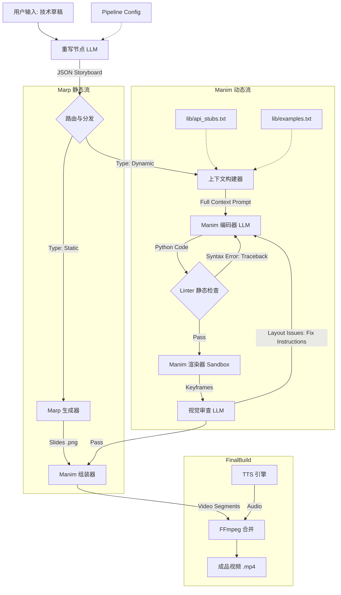
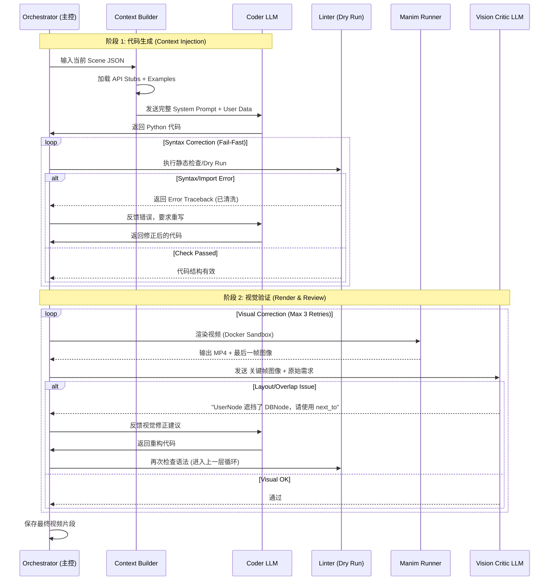
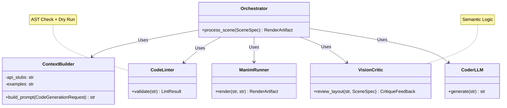

## 系统架构设计：自动化技术视频生成流水线 (v2.2 - Robust Context-Driven)

**版本:** 2.2 **更新日期:** 2025-12-14 **设计理念:** 上下文注入 (Context Injection) + 快速失败 (Fail-Fast) + 语义化修正 (Semantic Correction)

### 1. 核心设计变更 (Key Changes in v2.2)

1. **Pre-Render Linter (预渲染检查):** 在调用 Manim 渲染引擎前，增加 Python 语法检查与“空运行”环节，拦截 90% 的低级代码错误，节省 GPU 资源。
    
2. **Semantic Critic (语义化审查):** 强制视觉审查节点输出“基于组件关系的指令”（如 `next_to`），而非“基于坐标的指令”（如 `shift([0.5, 0, 0])`）。
    
3. **Prompt Optimization:** 在 System Prompt 中除 API 定义外，显式增加 3-5 个 **One-Shot Examples**（标准写法示例），利用 In-Context Learning 提升代码准确率。
    

### 2. 系统架构图 (System Architecture)



### 3. 核心交互时序图 (Interaction Sequence)

此图展示了从构建 Prompt 到最终生成的详细交互，特别是 **Linter** 和 **Critic** 的双重反馈循环。



### 4. 组件详细规范 (Component Specifications)

#### A. 上下文构建器 (Context Builder)

- **职责:** 组装最终发给 Coder 的 Prompt。
    
- **输入:** Scene JSON + 全局配置。
    
- **静态资源加载:**
    
    - `api_stubs.txt`: 从 `lib.components` 自动提取的精简接口定义。
        
    - `examples.txt`: 3-5 个“黄金标准”代码片段，展示如何正确实例化对象和调用动画。
        
- **输出:** 完整的 Context String。
    

#### B. 预渲染检查器 (Linter / Dry Run)

- **职责:** 在不生成像素的情况下，验证代码的可执行性。
    
- **操作:**
    
    1. **AST Check:** 检查 Python 语法错误。
        
    2. **Import Check:** 确保引用的 `lib.components` 类存在。
        
    3. **Dry Run:** 实例化 `Scene` 类但不执行 `render`，确保 `construct()` 方法内无逻辑崩溃。
        
- **反馈策略:** 如果失败，只提取 Traceback 的最后 3-5 行（最关键的错误信息）反馈给 LLM，避免 Token 浪费。
    

#### C. 视觉审查器 (Vision Critic - Semantic Mode)

- **Prompt 策略:** 明确禁止输出坐标值。
    
- **Bad Response:** "把 `server` 向右移动 20 像素。" (LLM 对像素无概念，容易出错)
    
- **Good Response:** "检测到 `server` 与 `database` 重叠。请修改代码，确保 `server` 使用 `next_to(database, LEFT, buff=1.0)` 进行相对定位。"
    

#### D. 渲染器 (Manim Runner)

- **安全:** 运行在无网络权限的 Docker 容器中。
    
- **超时:** 设定严格的 `timeout` (如 60秒/片段)，防止死循环占用资源。
    
- **自动裁剪:** 根据音频时长参数，自动调整 `wait()` 时间或 `RunTime`。
    

### 5. 关键数据结构

#### 目录结构更新

```
src/
├── core/
│   ├── orchestrator.py       # 主控逻辑 (Interaction Sequence 实现)
│   ├── models.py             # Pydantic 数据模型 (跨模块数据交换)
│   └── config.py             # 全局配置加载
├── components/
│   ├── context_builder.py    # 负责组装 Prompt (Prompt Engineering)
│   ├── linter.py             # 预渲染检查器 (AST + Dry Run)
│   ├── renderer.py           # Manim 渲染器 (Docker 封装)
│   └── critic.py             # 视觉审查器 (VLM 客户端)
├── llm/
│   ├── client.py             # LLM 抽象层 (Coder & Rewriter)
│   └── prompts.py            # Prompt 模板库
└── utils/
    ├── file_ops.py
    └── logger.py
```

#### Prompt 模板 (v2.2)

```
# ROLE
You are an expert Manim animation developer using a custom library.

# LIBRARY API (Strictly adhere to this)
{content_of_api_stubs_txt}

# REFERENCE EXAMPLES (Learn the pattern)
{content_of_examples_txt}

# SCENE DATA
{json_scene_data}

# CONSTRAINTS
1. Total duration: {duration} seconds.
2. DO NOT use absolute coordinates (shift, move_to) unless necessary.
3. PREFER relative positioning (next_to, align_to).
4. Return ONLY valid Python code.

# ERROR CORRECTION (If applicable)
Previous attempt failed with:
{cleaned_traceback_or_critic_feedback}
Fix the code based on the error.
```

### 6. 风险控制与降级策略

1. **Linter 循环熔断:** 如果 Linter 报错超过 3 次，系统自动降级为生成一张静态的 Marp 幻灯片，不再尝试写代码，确保流水线不崩溃。
    
2. **API 版本漂移:** 必须在 CI/CD 流水线中运行 `tools/extract_stubs.py`，确保每次 `components.py` 修改提交时，`api_stubs.txt` 自动更新。
    
3. **幻觉调用:** 如果 LLM 坚持调用不存在的函数，Linter 会捕获 `AttributeError`，并将其反馈给 LLM，通常 LLM 在看到错误后能自我修正。
    

#### 总结

v2.2 架构通过 **Context Injection** 解决了 RAG 的不稳定性，通过 **Linter** 解决了渲染的高成本问题，通过 **Semantic Critic** 解决了视觉微调的不可控问题。这是一个工业级的生成式架构。

### 核心数据模型 (Data Models)

使用 `Pydantic` 定义，确保模块间交互的数据类型安全。

```Python
# src/core/models.py
from pydantic import BaseModel, Field
from typing import List, Optional, Literal, Dict

class SceneSpec(BaseModel):
    """描述一个视频场景的元数据"""
    scene_id: str
    description: str
    duration: float
    elements: List[str]  # 涉及的实体，如 ["Database", "User"]
    audio_script: str

class CodeGenerationRequest(BaseModel):
    """发送给 Coder LLM 的请求"""
    scene: SceneSpec
    previous_code: Optional[str] = None
    feedback_context: Optional[str] = None  # Linter 报错或 Critic 建议

class LintResult(BaseModel):
    """Linter 的检查结果"""
    passed: bool
    error_type: Optional[Literal["SYNTAX", "IMPORT", "RUNTIME", "NONE"]] = "NONE"
    traceback: Optional[str] = None  # 清洗后的关键错误信息
    line_number: Optional[int] = None

class CritiqueFeedback(BaseModel):
    """Vision Critic 的反馈结果"""
    passed: bool
    score: int = Field(..., ge=0, le=10)
    # v2.2 Semantic Correction: 强制要求语义化建议
    suggestion: Optional[str] = None 
    # e.g., "Use next_to(obj_a, obj_b) instead of manual coordinates"

class RenderArtifact(BaseModel):
    """渲染产物"""
    video_path: str
    last_frame_path: str
    code_content: str
```

---

### 3. 核心接口定义 (Core Interfaces)

#### A. 上下文构建器 (Context Builder)

负责实现 v2.2 的 **Context Injection**。

```Python
# src/components/context_builder.py
from pathlib import Path

class ContextBuilder:
    def __init__(self, lib_path: Path):
        self.api_stubs = self._load_file(lib_path / "api_stubs.txt")
        self.examples = self._load_file(lib_path / "examples.txt")

    def build_prompt(self, request: 'CodeGenerationRequest') -> str:
        """
        组装 System Prompt 和 User Prompt。
        如果是重试（request.feedback_context 非空），则注入错误修正指令。
        """
        pass
        
    def _load_file(self, path: Path) -> str:
        """读取静态资源文件"""
        pass
```

#### B. 预渲染检查器 (Linter / Dry Run)

实现 **Fail-Fast** 机制的核心。

```Python
# src/components/linter.py
from src.core.models import LintResult

class CodeLinter:
    def validate(self, code: str) -> LintResult:
        """
        统一入口：依次执行 静态语法检查 -> 依赖检查 -> Dry Run
        """
        syntax_res = self._check_syntax(code)
        if not syntax_res.passed:
            return syntax_res
            
        return self._dry_run(code)

    def _check_syntax(self, code: str) -> LintResult:
        """使用 Python ast 模块进行 AST 解析"""
        pass

    def _dry_run(self, code: str) -> LintResult:
        """
        在受限子进程中加载类，但不执行 construct() 内的耗时动画。
        目的：检测 Class 实例化错误或明显的逻辑崩溃。
        """
        pass
```

#### C. 视觉审查器 (Vision Critic)

实现 **Semantic Correction**。

```Python
# src/components/critic.py
from src.core.models import CritiqueFeedback, SceneSpec

class VisionCritic:
    def review_layout(self, image_path: str, scene_spec: SceneSpec) -> CritiqueFeedback:
        """
        调用多模态大模型 (如 GPT-4o / Gemini 1.5 Pro)。
        
        System Prompt 关键约束：
        "You are a layout inspector. If overlap occurs, provide a Python command 
         fix using 'next_to' or 'align_to'. DO NOT suggest pixel shifts."
        """
        pass
```

#### D. 渲染器 (Manim Runner)

```Python
# src/components/renderer.py
from src.core.models import RenderArtifact

class ManimRunner:
    def render(self, code: str, scene_name: str, quality: str = "low") -> RenderArtifact:
        """
        调用 Docker 容器运行 Manim。
        
        Args:
            quality: 开发阶段用 'low' (480p15fps) 加速，最终输出用 'high'
        Returns:
            RenderArtifact 对象，包含视频路径和最后一帧截图路径
        Raises:
            TimeoutError: 如果渲染超时
            RenderError: 如果 Manim 引擎报错
        """
        pass
```

---

### 4. 主控逻辑伪代码 (Orchestrator Implementation)

这是 `src/core/orchestrator.py` 中将所有组件串联起来的逻辑，对应时序图的 `_process_dynamic_scene` 部分。

```Python
class Orchestrator:
    # ... 初始化各组件 ...

    def process_scene(self, scene_data: SceneSpec) -> RenderArtifact:
        """
        v2.2 核心循环实现：生成 -> Linter -> Render -> Critic
        """
        current_feedback = None
        previous_code = None
        
        # --- 循环 1: 代码生成与语法修正 (Linter Loop) ---
        # 最多尝试 3 次语法修复
        for attempt in range(3):
            # 1. 构建 Prompt (包含上次的错误信息)
            req = CodeGenerationRequest(
                scene=scene_data,
                previous_code=previous_code,
                feedback_context=current_feedback
            )
            prompt = self.context_builder.build_prompt(req)
            
            # 2. 生成代码
            raw_code = self.coder_llm.generate(prompt)
            # 提取代码块逻辑...
            
            # 3. Linter 检查 (Fail-Fast)
            lint_res = self.linter.validate(raw_code)
            
            if lint_res.passed:
                previous_code = raw_code # 暂存有效的代码
                break # 语法检查通过，进入视觉阶段
            else:
                # 收集错误 Traceback，准备下一次循环
                current_feedback = f"Syntax/Runtime Error:\n{lint_res.traceback}"
                previous_code = raw_code
        else:
            raise MaxRetriesExceeded("无法生成语法正确的代码")

        # --- 循环 2: 视觉渲染与语义修正 (Critic Loop) ---
        # 最多尝试 2 次视觉微调
        for vision_attempt in range(2):
            # 4. 渲染视频 (Sandbox)
            try:
                artifact = self.runner.render(previous_code, scene_data.scene_id)
            except Exception as e:
                # 如果运行时崩溃（虽然 Linter 尽力拦截了），回退到 Coder
                current_feedback = str(e)
                # ... 这里需要递归调用或跳转回 Linter Loop，为简化略去 ...
                continue

            # 5. 视觉审查
            critique = self.critic.review_layout(artifact.last_frame_path, scene_data)
            
            if critique.passed:
                return artifact # 成功！
            else:
                # 6. 语义化修正
                current_feedback = f"Visual Layout Issue: {critique.suggestion}"
                # 重新调用 Coder 进行修改
                req = CodeGenerationRequest(
                    scene=scene_data, 
                    previous_code=previous_code, 
                    feedback_context=current_feedback
                )
                prompt = self.context_builder.build_prompt(req)
                previous_code = self.coder_llm.generate(prompt)
                
                # 注意：修改后的代码必须再次经过 Linter，为简化伪代码，此处假设 Linter 嵌入在 generate 内部或忽略
        
        # 降级策略
        print("视觉修正失败，使用最后一次可用的渲染结果。")
        return artifact
```

### 5. 模块关系图

为了更清晰地展示各模块间的依赖关系，我为你生成一张类关系图。



### 6. 设计总结

1. **接口隔离原则**: `Linter` 只负责代码能不能跑，`Critic` 只负责画面对不对。两者的反馈通过标准化的 `LintResult` 和 `CritiqueFeedback` 传递给 Orchestrator。
    
2. **鲁棒性**: 通过 `CodeGenerationRequest` 中的 `feedback_context` 字段，实现了闭环反馈机制。
    
3. **扩展性**: `renderer.py` 封装了 Docker 调用，未来如果要换成本地运行或云端 GPU 集群，只需修改此模块，上层逻辑无感。